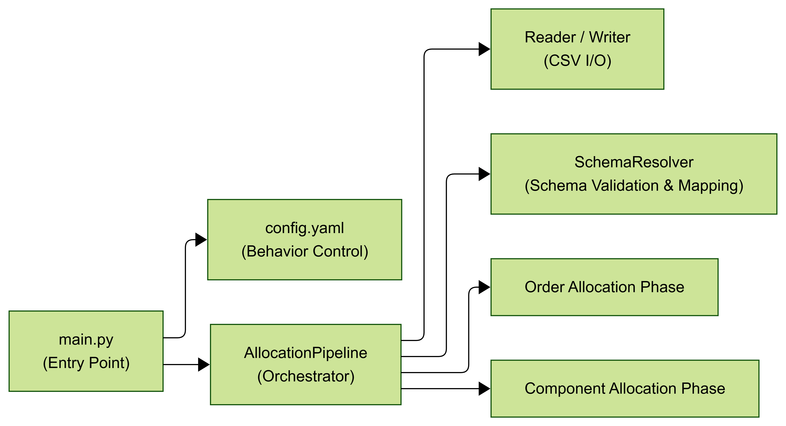
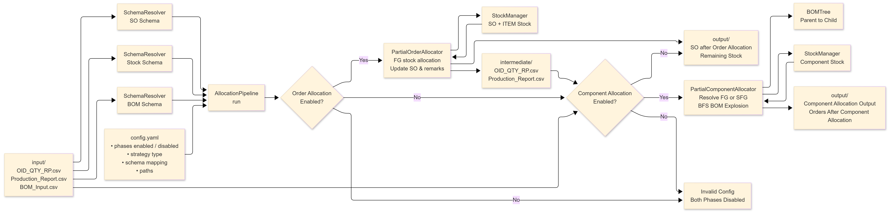
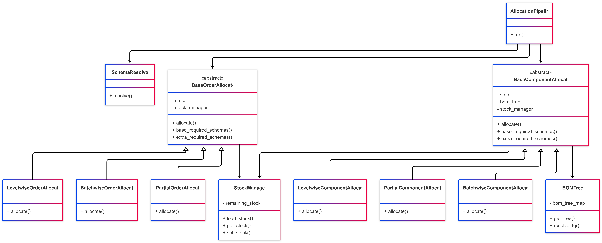
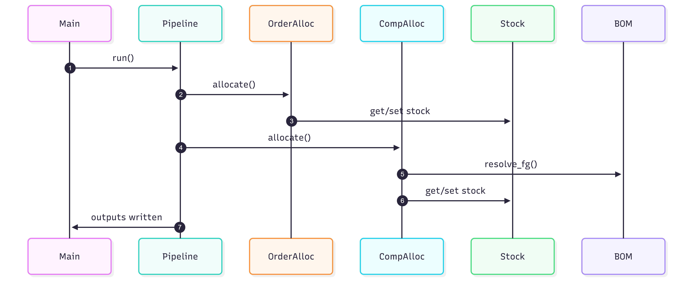

# 🏗️ Architecture

This project implements a **configuration-driven allocation engine** for manufacturing and supply-chain scenarios.

It supports:

- **Order Allocation**
- **Component Allocation**

using interchangeable strategies (**partial, batchwise, levelwise**, etc.), while maintaining:

- Clean separation of concerns
- Extensibility
- Strong OOP and design-pattern principles

---

## 1. Architectural Overview

At a high level, the system follows a **pipeline-based architecture** where data flows through well-defined stages controlled entirely by configuration.

### Key Characteristics

- Strategy-based allocation (plug-and-play)
- Phase-driven execution
- Clear data lifecycle  
  **Input → Intermediate → Output**
- Strong use of OOP principles and design patterns

---

## 2. High-Level System Architecture

---
Mermaid Code:
```
---
config:
  layout: elk
  theme: base
---
flowchart LR
    MAIN["main.py\n(Entry Point)"] --> CFG["config.yaml\n(Behavior Control)"] & PIPE["AllocationPipeline\n(Facade / Orchestrator)"]
    PIPE --> IO["Reader / Writer\n(CSV I/O)"] & SR["SchemaResolver\n(Schema Validation & Mapping)"] & OA["Order Allocation Phase"] & CA["Component Allocation Phase"]
```
### Explanation:
- **main.py** — bootstrap: load config, set up logger, run pipeline.

- **AllocationPipeline** (`pipeline/allocation_pipeline.py`) — orchestrates phases and data flow.

- **Phase Registry** (`pipeline/phase_registry.py`) — maps config type → concrete strategy.

- **Order Allocators** (`core/order_allocation/`) — strategies for SO-level allocation.

- **Component Allocators** (`core/component_allocation/`) — BOM explosion logic + allocation.

- **StockManager** (`common/stock_manager.py`) — single source of stock truth for the run.

- **BOMTree** (`common/bom_tree.py`) — precomputed BOM tree keyed by (Finished_Good, Plant).

- **SchemaResolver** (`utils/schema_resolver.py`) — validates and renames CSV columns according to config schemas.

- **EngineLogger** (`utils/logger.py`) — run-based logger writing normal + error logs.

---

## 3. Data Flow & Lifecycle
The system processes data through a predictable lifecycle:
```
Input → Schema Validation → Allocation Phases → Output
```
Depending on configuration, an intermediate layer may be introduced between phases.

---

### Input Ingestion
- Pipeline reads one or more CSV inputs.
- CSV headers are resolved using a `SchemaResolver` to normalize column names.

---

### Order Allocation (Optional)
- Loads stock data via `StockManager`.
- Aggregates stock at:
  - Sales Order (SO) level
  - Item level
- Executes an Order Allocation strategy:
  - Allocates available stock to sales orders
  - Produces:
    - Updated sales orders
    - Remaining (unallocated) stock
- `StockManager` is mutated to reflect post–order allocation stock state.

---

### Component Allocation (Optional)
- Builds a `BOMTree` from BOM master data.

#### BOMTree Responsibilities
- Organizes BOMs uniquely by `(Finished_Good, Plant)`.
- Constructs a hierarchical parent → child BOM structure per FG and plant.
- Maintains a reverse lookup index to resolve:
  - Semi-Finished Goods (SFGs): Orders can be placed on SFG
  - Intermediate components
  back to their root Finished Good.
- Provides BOM resolution utilities for downstream allocation logic.

#### Component Allocation Flow
- Uses the mutated `StockManager` from Order Allocation.
- Resolves the appropriate BOM using `BOMTree.resolve_fg(fg, plant)`:
  - `ROOT` → FG is a top-level finished good
  - `SFG` → FG is an intermediate material mapped to a root FG
  - `NOT_FOUND` → No applicable BOM exists
- Component Allocation strategy:
  - Traverses (explodes) the resolved BOM tree
  - Computes required component quantities using BOM ratios
  - Allocates available component stock accordingly

---

### Output Generation
- Writes allocation results and residual stock data to configured output paths.

---

## 4. End-to-End Data Flow (All Phase Combinations)

---
Mermaid Code:
```
graph TB
    CFG["config.yaml"]
    IN_INPUT["input/\nOID_QTY_RP.csv\nProduction_Report.csv\nBOM_Input.csv"]
    SR_SO["SchemaResolver\nSO Schema"]
    SR_STOCK["SchemaResolver\nStock Schema"]
    SR_BOM["SchemaResolver\nBOM Schema"]
    PIPE["AllocationPipeline"]
    OA_ENABLED{"Order Allocation\nEnabled?"}
    CA_ENABLED{"Component Allocation\nEnabled?"}
    OA["Order Allocation Strategy\n(Partial / Batchwise / Levelwise)"]
    CA["Component Allocation Strategy\n(Partial / Batchwise / Levelwise)"]
    INTERMEDIATE["intermediate/\nUpdated SO\nUpdated Stock"]
    OUT_ORDER["output/\nAfter Order Allocation"]
    OUT_COMP["output/\nAfter Component Allocation"]
    INVALID["Invalid Configuration\n(Both Phases Disabled)"]

    CFG --> PIPE
    IN_INPUT --> SR_SO --> PIPE
    IN_INPUT --> SR_STOCK --> PIPE
    IN_INPUT --> SR_BOM --> PIPE
    PIPE --> OA_ENABLED
    OA_ENABLED -- Yes --> OA --> INTERMEDIATE --> CA_ENABLED
    OA_ENABLED -- No --> CA_ENABLED
    CA_ENABLED -- Yes --> CA --> OUT_COMP
    CA_ENABLED -- No --> OUT_ORDER
    OA_ENABLED -- No --> INVALID
    CA_ENABLED -- No --> INVALID
```

## Supported Configurations

| Order Allocation | Component Allocation | Behavior                          |
|------------------|----------------------|-----------------------------------|
| Enabled          | Enabled              | Full pipeline                     |
| Enabled          | Disabled             | Stops after order allocation      |
| Disabled         | Enabled              | Direct component allocation       |
| Disabled         | Disabled             | ❌ Invalid configuration          |

---

## 5. Object-Oriented Design (Class Architecture)

---
Mermaid Code:
```
classDiagram
    class BaseOrderAllocator {
        <<abstract>>
        - so_df
        - stock_manager
        + allocate()
        + base_required_schemas()
        + extra_required_schemas()
    }

    class BaseComponentAllocator {
        <<abstract>>
        - so_df
        - bom_tree
        - stock_manager
        + allocate()
        + base_required_schemas()
        + extra_required_schemas()
    }

    class PartialOrderAllocator
    class BatchwiseOrderAllocator
    class LevelwiseOrderAllocator
    class PartialComponentAllocator
    class BatchwiseComponentAllocator
    class LevelwiseComponentAllocator

    class AllocationPipeline {
        + run()
    }

    class StockManager {
        - remaining_stock
        + load_stock()
        + get_stock()
        + set_stock()
    }

    class BOMTree {
        - bom_tree_map
        + get_tree()
        + resolve_fg()
    }

    class SchemaResolver {
        + resolve()
    }

    %% Inheritance
    BaseOrderAllocator <|-- PartialOrderAllocator
    BaseOrderAllocator <|-- BatchwiseOrderAllocator
    BaseOrderAllocator <|-- LevelwiseOrderAllocator

    BaseComponentAllocator <|-- PartialComponentAllocator
    BaseComponentAllocator <|-- BatchwiseComponentAllocator
    BaseComponentAllocator <|-- LevelwiseComponentAllocator

    %% Associations
    AllocationPipeline --> BaseOrderAllocator
    AllocationPipeline --> BaseComponentAllocator
    AllocationPipeline --> SchemaResolver
    BaseOrderAllocator --> StockManager
    BaseComponentAllocator --> StockManager
    BaseComponentAllocator --> BOMTree
```

---

## 6. Strategy Pattern (Extensibility)
Mermaid Code:
```
classDiagram
    class AllocationPipeline

    class OrderAllocationStrategy {
        <<interface>>
        + allocate()
    }

    class ComponentAllocationStrategy {
        <<interface>>
        + allocate()
    }

    %% Associations
    AllocationPipeline --> OrderAllocationStrategy
    AllocationPipeline --> ComponentAllocationStrategy
```

---

## 7. OOP Concepts Used

### Abstraction
- **BaseOrderAllocator**
- **BaseComponentAllocator**

These define *what* allocation means, not *how* it is done.

---

### Inheritance
- Partial, Batchwise, and Levelwise allocators inherit from the base classes.

---

### Polymorphism
- The pipeline invokes `allocate()` without knowing the concrete strategy.
- Strategy selection happens at runtime via configuration.

---

### Encapsulation
- **StockManager** encapsulates stock mutation logic.
- **BOMTree** encapsulates BOM resolution and traversal.
- **SchemaResolver** encapsulates schema validation.

---

### Open–Closed Principle
New strategies can be added without modifying:
- `AllocationPipeline`
- Existing allocation strategies
- Stock or BOM infrastructure

---

## 8. Runtime Interaction (Sequence Diagram)

---
Mermaid Code:
```
sequenceDiagram
participant Main
participant Pipeline
participant OrderAlloc
participant CompAlloc
participant Stock
participant BOM
Main ->> Pipeline: run()
Pipeline ->> OrderAlloc: allocate()
OrderAlloc ->> Stock: get / set stock
Pipeline ->> CompAlloc: allocate()
CompAlloc ->> BOM: resolve FG / SFG
CompAlloc ->> Stock: get / set stock
Pipeline ->> Main: write outputs
```

---

## 9. How to Extend the ETL Pipeline with New Allocation Strategies?

New allocation strategies implement abstract base classes in  
`core/*/base_*_allocator.py` and are registered in `phase_registry.py`.
